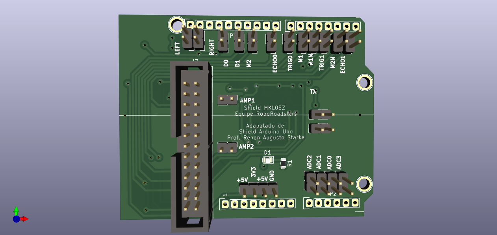

# Interface shield

This shield was adapted to connect MKL05Z pins to the car's power board. Go to [Power Board](hhttps://github.com/xtarke/automated_buggy/tree/master/power_board) for more hardware information.

## Analog pins

| Analog input  | KL05Z pin  | Board label  | Signal |
| ------------- | -------- | ------------ | ------ |
| ADC0          | PTA8       |   ADC0       | Bat0   |
| ADC1          | PTB9       |   ADC1       | Bat1   |
| ADC2          | PTB8       |   ADC2       | Ampop1 |
| ADC3          | PTA0       |   ADC3       | Ampop2 |

## Ultrasonic sensor

| MK05Z Pin | Signal|
| ------- | ------|
| PTB10       | Echo0 |
| PTB7       | Trig0 |
| PTA11       | Echo1 |
| PTA10       | Trig1 |

## Motors

|MK05Z Pin | Signal|  Board label |
| ---------- | ------| ------------ |
| PTB6          | PWM1  |  M1          |
| PTA12          | PWM1N |  M1N         |
| PTA5         | PWM2  |  M2          |
| PTB5          | PWM2N |  M2N         |

## Speed econder

| MKL05Z Pin | Signal |  Board label |
| ----------- | ------ | ------------ |
| PTB0          | D0     | ENC0         |
| PTA6          | D1     | ENC1         |

## Optic sensor

| MKL05Z Pin | Signal | Board label |
| ----------- | ------ | ----------- |
| PTB4          | R_TCRT | R DIR       |
| PTB3        | L_TCRT | L ESQ       |

## UART

| MKL05Z Pin | Signal |
| ------- | ------ |
| TX      | TX     |
| RX      | RX     |

